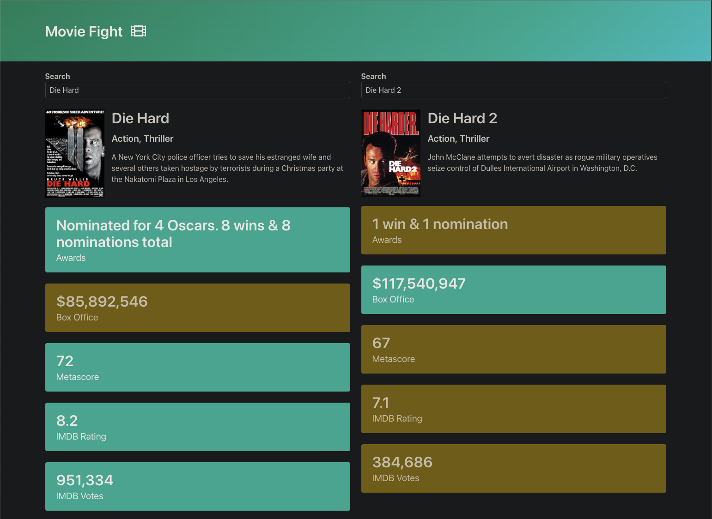

# Movie Fight

Movie Fight is a movie comparison application that allows users to search for two movies and compare their details such as box office earnings, awards, and ratings. This app uses the OMDB API to fetch detailed movie information and visually presents the comparison results.

## Features

- **Search for Movies:** Enter a movie name in the search box to find movies.
- **Compare Movie Details:** Compare two movies side by side based on various attributes.
- **Detailed Information:** Displays movie posters, genres, plots, and more.

## Technologies Used

- **HTML & CSS:** For structuring and styling the web page.
- **JavaScript:** For implementing the autocomplete and comparison functionalities.
- **Axios:** For making API requests to the OMDB API.
- **Bulma:** For responsive and modern CSS styling.
- **OMDB API:** For fetching detailed movie information.

## Getting Started

### Prerequisites

- A modern web browser

### Installation

1. Clone the repository:
    ```sh
    git clone https://github.com/Breedlove-Jason/movie-fight.git
    ```
2. Open `index.html` in your web browser.

## Usage

1. Enter the name of a movie in the search box on the left.
2. Select a movie from the dropdown list.
3. Repeat the steps for the search box on the right.
4. The app will display detailed information and highlight the better movie based on various attributes.

## License

This project is licensed under the MIT License - see the [LICENSE](LICENSE) file for details.

## Acknowledgments

- [OMDB API](http://www.omdbapi.com/) for providing the movie data.
- [Bulma](https://bulma.io/) for the beautiful CSS framework.
- [Axios](https://axios-http.com/) for the easy-to-use HTTP client.
